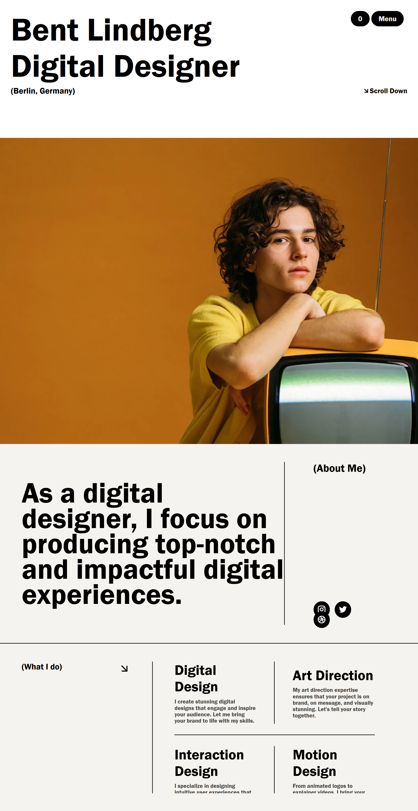

# Bent Lindberg Landing Page Clone

A responsive landing page clone inspired by the Bent Lindberg portfolio website. This project was built using HTML and CSS to practice frontend development and modern UI design.

## Features

* Responsive layout
* Clean modern design
* Typography-focused UI
* Hero section
* About section
* Services section

## Technologies Used

* HTML5
* CSS3

## Preview

## Author

Yash Kudesia
